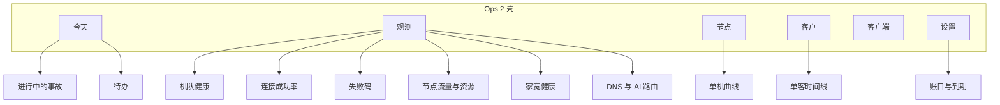
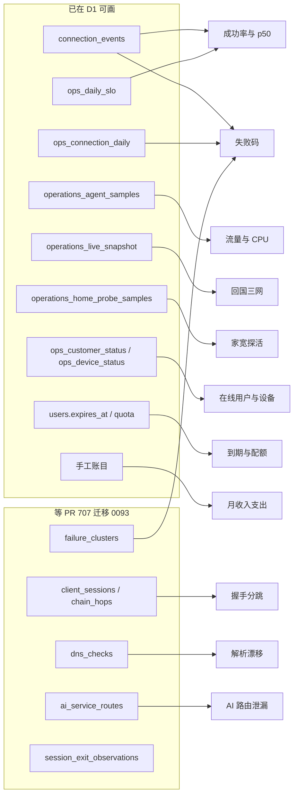

# Ops 1 / Ops 2 对照与可视化方案

基准：`origin/main` `d2363002`（2026-09-30，已含 PR #698）。本轮只读，没有改代码、没有开 PR。

开放 PR 共 25 个。和本题目直接相关的只有草稿 [#707](https://github.com/raydocs/tono/pull/707)（分支 `cursor/diagnostics-control-plane-e0fd`，云代理 [Telemetry and crash auto-upload](https://cursor.com/agents/bc-eb7fcbc6-0c27-5beb-a66d-0e792a5ae0fd)）。其余开放 PR 是客户端修复、安装诊断和 dependabot（含 ops-console 依赖 #672），不改变控制台功能面。

`docs/ops/parity-audit.md` 写于 2026-09 上旬，当时列的客户写动作、目录编辑器、家宽库存、白名单，在当前 main 上已经接到 ops 2。下文以源码为准，不以那份缺口表为准。

仓库里没有第三套运营后台。VPS 上的 `ops-panel/collect.py` 只向同一个 Worker 推 `PUT /api/v1/ops-ingest/snapshot`，不是给人用的控制台。

---

## 1. 哪两个目录是 ops 1 和 ops 2

两套界面共用一个 D1（`tono-control-plane`）和一套 `/api/v1/ops/*`。浏览器入口都在 `https://admin.afk.ccwu.cc`，外层是 Cloudflare Access。

| | Ops 1（旧后台） | Ops 2（新后台） |
|---|---|---|
| 口头称呼 | `/ops/` | `/ops2/` |
| 源码 | `services/control-plane/admin/` | `services/ops-console/` |
| 构建 | `npm run admin:build` → `services/control-plane/public/ops/` | `npm run console:build` → `public/ops2/`（`vite build --base /ops2/`） |
| 入口 | `admin/index.html` → `admin/src/main.tsx` | `services/ops-console/index.html` → `src/main.tsx` → `src/app/App.tsx`、`src/app/Shell.tsx` |
| 路由 | hash：`#/dashboard` `#/failures` `#/monitor` `#/users` `#/traffic` `#/control` | hash：`#/today` `#/nodes` `#/customers` `#/clients` `#/settings/<section>` |
| 栈 | React 19 + Vite 8，无路由库，无图表库；自绘 SVG（`admin/src/charts.tsx`） | React 19.3、Vite 8、Tailwind 4、Radix、cmdk、Geist。`package.json` 无 Recharts/visx。自绘 `Sparkline` / `TimeSeries` / `HeatStrip` |
| 最近实质提交 | 产品面停在 2026-08-27 一批控制台修复；2026-09-23 `241e5831` 只把策略修订号绑进签名 JSON | 2026-09-25 `8360e69f` 账目锁月重试与冲正警告；同日还有开通到期、关户审计 |

### 部署与鉴权

- 静态资源与 API 由控制面脚本一起发：`services/control-plane/package.json` 的 `deploy` → `tooling/scripts/deploy-control-plane-main.sh`。顺序是 D1 迁移、API Worker、再 Admin Worker。两次构建（`admin:build` 与 `console:build`）都在这条脚本里。
- API Worker：`wrangler.jsonc` 名 `tono-control-plane-staging`，域名 `api.afk.ccwu.cc`（以及 `releases.afk.ccwu.cc`）。名字带 staging，绑定的是生产库 `tono-control-plane`。
- Admin Worker：`wrangler.admin.jsonc` 名 `tono-admin-production`，域名 `admin.afk.ccwu.cc`。`ops.afk.ccwu.cc` 与 `quality.afk.ccwu.cc` 被收进同一 Worker，并重定向到 `/ops/#/monitor`。`/api/v1/ops/*` 经 service binding `API` 转到 API Worker。
- 鉴权：请求头 `cf-access-jwt-assertion`，`verifyAccessRequest`（`src/access.ts`）核对团队、`ACCESS_AUD`、邮箱是否在 `ACCESS_ADMIN_EMAILS`。浏览器只带 `credentials: 'same-origin'`，不使用 `ADMIN_API_TOKEN`。令牌走另一条 `/api/v1/admin/*`。
- 角色：可选环境变量 `OPS_ROLES`。未配置或邮箱不在表内时，`resolveOpsRole` 一律当成 `owner`。v1 路由在 `dispatchOpsV1` 里 `requireCan`。生产 changelog（2026-09-26）写明当时未配置 `OPS_ROLES`，因此 H4-F3 不阻断发布，但角色模型并没有落地。

Ops 2 仍通过别名 `@legacy-lib` 引用 `services/control-plane/admin/src/lib/`。删掉 admin 目录会拆掉新控制台，那个目录不是死代码。

---

## 2. 功能总表

图例：有 = 当前页面能做完；只读 = 能看不能改；部分 = 能做但缺一块或藏在别的页；无 = 没有入口。

| 功能 | Ops 1 | Ops 2 | 说明 |
|---|---|---|---|
| 今日事故板（ack / 暂缓 / 结案 / 备注） | 无（故障页是客户端用 live+activity 拼的快照） | 有 `#/today` | 结案必须带 closure：`verified` / `false_positive` / `manual`。`false_positive` 不算恢复 |
| 跟进与早报 | 无 | 有 | `GET/POST followups`、`GET digest`。digest 的 worthwhile 字段在类型注释里写明恒为空 |
| KPI：在线、被墙、额度、将到期 | 有，总览条 | 部分 | 今天页是事故/待办数字，不是那条库存 KPI |
| 闲置家宽 / 闲置 Claude 计数 | 有 `GET dashboard` | 无 | 接口仍在 legacy `dashboard` |
| 运营待办（额度、到期、目录落后） | 有，总览内前端推导 | 有，今天页「待办」 | 口径不一致，见第 3 节 |
| 谁在线 | 有，最多一截列表 | 有，客户列表筛选 | |
| 节点列表、筛选、卡片/表 | 有 `#/monitor` | 有 `#/nodes` | |
| 单机事实、占用、三网/大陆可达 | 有，节点抽屉 | 有，节点详情 `Paths` | 三网来自 `operations_live_snapshot`，和用户接入 ISP 不是同一条腿 |
| 下架预览与确认 | 有 | 有 `ActionRail` | `fleet-nodes/{name}/retire-preview` 与 `retire` |
| 节点任务：摘目录、重新上架、同步身份、拉错误、重启、再探 | 无 | 有 `POST nodes/{name}/jobs` | Ops 2 多出来的闭环 |
| 节点账单档案（套餐、续费、账期） | 有，可写 `node-profiles` | 有 `ProfileDrawer` → `PATCH nodes/{name}/profile` | |
| 全机队 CPU/内存/负载 24h | 有，服务器页折叠里的 `AgentTrends` | 无全机队图 | 单机曲线在详情折叠 `Load`，数据同为 `GET metrics` |
| 单机 24h 资源曲线 | 有，抽屉 sparkline | 有，详情折叠后才请求 | |
| 线路/质量原文 | 有，抽屉折叠 | 有 `QualityText` | `GET fleet-nodes/{name}/quality-text` |
| 机器流量总览与 Top | 有 `#/traffic` 的 `RateChart` | 无图 | 节点列表只有文字合计 |
| 客户小时用量（机队） | 有 `GET usage-hours` sparkline | 无机队合计 | 客户详情有另一套 `customers/{id}/activity` 热力 |
| 客户列表、搜索、筛选 | 有 `#/users` | 有 `#/customers` | Ops 2 用 `GET customers` 并翻完游标（单页 200，上限 2000）。Ops 1 走 `GET users` |
| 开通客户 | 有 `POST users/onboard` | 有 `OnboardDrawer` | |
| 批量刷目录、批量续 30 天 | 有 | 有 | |
| 改到期、清零用量、联系备注、套餐 | 有，客户抽屉 | 有，详情账务 | 改到期会撤设备，文案已说明要重新登录 |
| 停用 / 恢复 / 注销 | 有 | 有 | `POST users/{id}/close`、`PATCH users/{id}` |
| 家宽绑定 / 换线 / 解绑 | 有 | 有，详情侧栏 | 走 `home-exits` 与 `users/{id}/home-binding` |
| 家宽库存：导入、登记、停用、删除 | 有，客户页「家宽库存」 | 有，设置「家宽库存」 | |
| 家宽账单（ISP、价格、账期、用量） | 无独立页（档案在节点侧） | 有，设置「家宽资产」 | `home-lines*` 只改账单列，没有 socks5 口令，不能当库存 |
| Claude / 产品号：开通、换号、封号 | 有 | 有 `ClaudeAccount` | `product-accounts*` |
| 设备动作：诊断、流量快照、刷新目录、重试断线保护 | 有 | 有，仅 macOS/Windows | Linux/Android/iOS 动作为空，按钮带原因禁用 |
| 吊销设备 | 有 | 有 | `DELETE devices/{id}` |
| 诊断日志 24h 窗口 | 接口有，旧页面没做 | 有，设备行 | `diagnostics-logs` PUT/DELETE |
| 原始诊断日志正文 | 无 | 无 | `GET diagnostics/logs/{id}` 能下 R2，两套 UI 都没做查看器。角色门也没罩住，见 H4-F3 |
| 诊断报告 JSON | 有，抽屉展开 | 部分 | 详情只显示摘要字段，没有全文 |
| 受保护路由证据 | 有 | 有，只读摘要 | |
| 注册白名单增删 | 接口有，页面无 | 有，设置「注册白名单」 | PATCH 某一条走 legacy，要求 `customers.write`；POST 新增走 shared-admin，无角色门 |
| 目录 YAML 编辑、diff、409、发布 | 有 `#/control` | 有，设置「目录」 | **两套都能 `PUT exit-catalog`** |
| 目录历史摘要 | 有 | 有，目录节折叠 | 非当前修订没有原文，两边都载不回旧 YAML |
| 直连规则 JSON 读/写/签名发布 | 有 | 有，设置「分流规则」 | |
| 关闭网页直连 / 关掉全部直连 | 有，编辑器快捷 | 无独立按钮 | 规则编辑器里改完再发即可 |
| 直连候选接受/拒绝/出草稿 | 无 | 有，设置「直连候选」 | 草稿再进分流规则发布 |
| 客户端版本矩阵与发布/撤回/最低版本 | 无 | 有 `#/clients` | `POST releases`（新建包）控制台故意不接 |
| 告警规则与投递记录 | 无 | 有，设置默认节「告警」 | |
| 商家账号 | 无 | 有 | `provider-accounts` |
| 账目、锁月、冲正、CSV | 无 | 有，设置「账目」 | 手工分类账，不是支付网关 |
| 连接成功率 / p50（SLO） | 无 | 部分 | 数据在 `ops_daily_slo`，UI 是账目页底部的表 `LedgerSlo`，不是图，也不在今天页 |
| 审计日志 | 有，总览「最近操作」 | 有，设置「操作记录」 | GET 先被 shared-admin 接走，不经 v1 的 `audit.read` |
| 系统健康 / 数据新鲜度 | 有，顶栏与各页 DataHealth | 有，顶栏药丸 + `system/health` | |
| Exit 令牌轮换、凭证 rollout、计量 rollout | 接口有，页面无 | 无 | 一次性操作，保持 curl，不要做按钮 |
| 节点占用事故旧接口 `incidents/node/{name}` | 客户端封装了，页面没调 | 无 | 用引擎 `ops_incidents` |
| 客户目的地「标记直连」 | 无 | 按钮在，文案「接口未接入」 | `Destinations.tsx` |
| 收入 / 订阅系统 | 无 | 部分 | 到期与配额在 `users`；钱在手工账目。没有 Stripe 一类账单 |

Ops 2 设置的十个小节：告警、目录、分流规则、家宽库存、家宽资产、账目、商家账号、直连候选、注册白名单、操作记录。默认落在告警。

---

## 3. Ops 2 能不能换掉 Ops 1

日常开通、改期、停用、绑家宽、发目录、发分流、下架节点、看事故，Ops 2 已经有入口。缺的不是「客户页四个按钮还disabled」——那些在 9 月下旬已经接上。

现在仍不能把 `/ops/` 摘掉。最小缺口如下，做完才谈替换。

1. **机队可视化仍只在 Ops 1。** 全机队 24h CPU/内存/负载、流量速率曲线、客户小时用量 sparkline、机器负载总表，Ops 2 没有对等页面。节点详情里的曲线要先点进某台机器再展开折叠。老板说两套都不好用，缺的就是这块，不是再迁一遍 CRUD。
2. **目录和分流有两个写入端。** `ControlPage.tsx` 与 `settings/Catalog.tsx` 都会 `PUT exit-catalog`；分流同理。`parity-audit.md` 写过双开会把机队撕开。替换的前提是 Ops 1 的发布按钮停用或整页改为只跳到 `/ops2/`，只留一个发布点。
3. **今天页缺少库存数字。** 闲置家宽、闲置 Claude 仍只有 `GET dashboard`。可以一行数字解决，不必搬回第六页。
4. **诊断报告全文**仍只在 Ops 1 抽屉。支持排障时会回到旧页。
5. **角色门 H4-F3 仍开放**（`docs/FINDINGS_LEDGER.md`）。`shared-admin` 自己声明不做授权。未罩住的包括：全部 shared-admin 写（目录、分流、家宽、设备、产品号、`POST signup-allowlist`）、`GET diagnostics/logs/{id}` 原始 gzip。合同里的 `customers.raw-logs` 没有接到任何路由。`#646` 只给 legacy 的 `PATCH signup-allowlist/{email}` 加了 `customers.write`。legacy 的多数 GET（dashboard、live、metrics、users）也没有 `requireCan`。只有在配置了 `OPS_ROLES` 且存在非 owner 时才构成越权；未配置时人人是 owner，门等于没装。启用角色之前必须先补这道门，否则 viewer 仍能发目录、下日志。
6. **数据口径会画错图**，见下。

### 数据正确性（画图之前先钉死）

- **`connection_events.edge_*` 是用户到 Cloudflare 的接入腿**（迁移 `0039` 的注释写明禁止和回国三网、质量探针、节点 ASN 混用）。`ops_daily_slo.carrier` 却是用 `edge_as_org` 的字符串猜移动/电信/联通（`slo-rollup.ts`）。图上如果标成「回程三网」，会把用户家宽运营商说成节点回国质量。三网图继续用 live snapshot / `Paths`。
- **H8-F4 仍开放。** `#404` 修了活动时长重复累加（迁移 0082）。字节从未写入活动行，真实字节来源留在 issue #403。客户「使用时段」热力的时长可用，字节不要当成计费真相。
- **计费用量**以 `usage_report_sources` 的单调水位为准。`docs/ops/metering-boundary-evidence-2026-09-14.md` 仍把双轨与旧空 source 的 MAX 当成未关闭边界。账目页不要用 `operations_user_usage_hours` 或活动热力去对钱。
- **待办阈值三套。** 客户投影 `choresFor` 用配额 ≥80%、到期 7 天；节点/家宽 UI 用 70% 待办、90% 警告。14 天是诊断日志保留（`DIAGNOSTICS_LOG_RETENTION_SECONDS`），不是待办窗口。
- **事故「已恢复」不等于客户已经能连上。** 只有 closure=`verified` 才表示量测回到正常；`manual` 是人点的，`false_positive` 从恢复计数里剔除。
- **列表上限。** Ops 2 `getAllJson` 翻到 2000 条。超过这个数，搜索、待办、命令面板会缺人。当前客户规模低于此，替换前要知道天花板。
- **SLO 按自然日由 cron 滚昨天。** 今天的成功率要直接查 `connection_events`，不能只读 `ops_daily_slo`。

令牌轮换和两种 rollout 两边都没有页面，保持文档加 curl，不算替换缺口。

---

## 4. 两边为什么都难用

### Ops 1

- 总览把被墙、失联、额度、家宽库存、在线的人、节点占用、用量 Top、审计塞在一页。主问题是「现在能不能连」，答案被其它计数盖住。
- 故障页不是事故史。它每次用 live 与 activity 现算，没有持续时长，没有认领。运营者无法回答「这场从几点开始、谁在处理」。
- 真正的图在「流量」页，以及服务器页折叠起来的「全机队 24h」。侧栏主入口是总览、故障、服务器、客户；流量和目录在「更多」里。
- 目录和规则是整页 YAML/JSON。能发版，但不能扫一眼「成功率掉了没有」。
- 产品面从 2026-08-27 起基本冻结。和 Ops 2 并存后，同一件事有两个入口、两套客户列表（`GET users` 与 `GET customers`）。

### Ops 2

- 信息架构按「办事」分：今天、节点、客户、客户端、设置。代理业务每天要看的成功率、失败码、延迟、节点流量，没有一页。唯一的成功率表嵌在 **设置 → 账目** 底部（`LedgerSlo.tsx`），和锁月、冲正放在一起。
- 节点页是卡片和一句合计。CPU、流量、质量原文都要进入 `#/nodes/:name` 再打开折叠才发请求。列表上看不出哪台在掉。
- 设置十节，其中「家宽库存」和「家宽资产」字面接近，数据模型不同（线路与口令 vs 账单列）。点错节就改错表。
- 客户页是宽表加版本筛选；版本矩阵在「客户端」，用 `?platform=&bucket=` 跳过来。路径有的是段（`#/nodes/名字`），有的是查询（`?node=` 抽屉、`?incident=`）。后退会落在抽屉开着或筛选还在的状态。
- 壳每 60 秒刷新；失败时留着上一份成功数据（`use-fleet.ts`），详情用 sticky。新鲜度药丸在顶栏，数字本身看起来像现在。
- 待办在浏览器里用多份列表重算，和 Worker 投影的 80%/7 天不是同一套规则，同一客户两页说法会不一样。
- 早报的「值得做」恒为空，打开是空块。
- 「标记直连」仍显示「接口未接入」。
- `README.md` 仍写设置「未建」，和十个已上线小节矛盾，接手的人会以为功能不存在。
- 源文件 400 行上限把一页拆成很多抽屉和折叠。功能在，扫视不在。
- 自定义 SVG 只有节点负载、配额条、客户 7 天热力。没有失败码随时间、没有分版本成功率、没有机队流量。

---

## 5. 可视化方案（做在 Ops 2）

选定 Ops 2。它已是日常写入面（事故、发布、客户动作、账目），包体预算也明确：首屏 JS gzip ≤ 400 KB，全部 JS ≤ 600 KB（`services/ops-console/scripts/check-budgets.mjs`）。Ops 1 的图可以当交互参考，不要把六页搬回来。

### 图该放哪

新的一级入口叫 **观测**，与「今天」并列。今天继续办事（事故、待办、认领）。观测回答「用户现在能不能用、坏在哪一跳」。

单客和单机不新做路由，只在现有详情顶部加同一套小图，点图跳到观测并带上筛选。

### 每块图用什么数

| 看板 | 图 | main 上已有 | 要等 #707 |
|---|---|---|---|
| 在线用户 / 设备 | 当前在线、按平台拆开的计数 | `ops_customer_status.connected`、`ops_device_status`、`devices.platform` | 会话级 `client_sessions` 可画「一次连接持续多久」 |
| 连接成功率 | 按小时的成功率折线；可切版本、平台、节点 | `connection_events` 的 `connectOk` / `connectFail`，维度已有 `platform`、`app_version`、`node`、`elapsed_ms`、`code`。日汇总有 `ops_daily_slo`（attempts、successes、p50_ms）和 `ops_connection_daily` | 增加 `app_build`、`channel`、`core_version`，才能把「这个包」和「这个版本名」分开 |
| 失败码随时间 | 堆叠条，kind+code | 同上，`kind` 已含 connectFail 等 | 视图 `v_failure_by_version`；`failure_clusters` 把同一 code+stage+版本+平台+节点收成一条事故。新 kind：`signInFail`、`releaseFail`、`syncFail`、`healthProbeFail`、`appCrash`、`killSwitchFail` |
| 握手 / 延迟 | 分位数 | `elapsed_ms`、`delay_ms`、`exit_delay_ms`、`tcp_delay_ms`；SLO 已有日 p50 | `chain_hops.handshake_ms` 按入口 / 家宽分跳。在此之前不要把 elapsed 说成某一跳 |
| 节点流量与资源 | 每节点入出字节速率、CPU、内存 | `operations_agent_samples` / `operations_agent_rollups` 的 net、cpu、mem；`GET metrics` 已给 Ops 1 和节点 `Load` 用过 | `connection_events.bytes_up/down` 与 `client_sessions` 字节是客户端视角，和探针网卡计数不要画在同一条轴上 |
| 家宽健康 | 存活比例、连续失败 | `operations_home_probe_samples.status`，`home_exits.status` | `session_exit_observations` 只有 /24 与哈希，用来看出口是否从住宅漂成机房，不能当 IP 清单 |
| DNS 漂移 | 隧道外解析、IPv6、解析器国家与出口国家不一致 | **没有表** | `dns_checks`（resolver、leak_outside、ipv6_leak、geo_matches_exit） |
| AI 路由泄漏 | Claude/OpenAI 走了住宅、机房还是直连 | **没有表**。目的地日表 `traffic_destination_daily` 是粗 family，不是 AI 泄漏 | `ai_service_routes`，且仅 `claude`/`openai`，摄入要同意，保留 60 天 |
| 订阅 / 收入 | 将到期人数、配额将满、本月收与支 | `users.expires_at`、`quota_bytes`、`usage_bytes`；账目 API 已有月汇总 | 不依赖 #707。不要新建支付系统 |

`GET /api/v1/ops/slo` 已经按 7 天或 30 天返回 `ops_daily_slo`，观测页第一张图可以直接用它做日成功率，同时另开一个「今天」查询走 `connection_events`，避免等 cron。失败码用现有 `ops_connection_daily`，缺口是按小时的接口，不是缺原始事件。

#707 另有 `GET /api/v1/diagnostics/clusters`（要 `DIAGNOSTICS_READ_TOKEN`，未设置则 503）和 `GET /api/v1/ops/customers/{id}/diagnostics`（Access + `customers.read`）。控制台只加了文案和 `codes.ts`，没有面板。观测页应走 ops 角色门的客户诊断路由，不要把只读令牌放进浏览器。

隐私边界沿用 #707 的 `docs/diagnostics-privacy.md`：图上不出现完整 IP、主机名、URL、邮箱。原始日志仍受 `diagnostics_log_access` 限制。

### 图表库

沿用现有自绘 SVG，不引入 Recharts。`App.tsx` 里提到 Recharts 的注释已经过时，依赖里也没有它。首屏 400 KB gzip 的预算经不起再塞一套图表运行时，而且控制台的字、空态、新鲜度规则都绑在自己的组件上。

做法：

- 把 `TimeSeries`、`HeatStrip`、`Sparkline` 收成观测页能复用的三件：多序列折线（成功率、p50）、堆叠条（失败码）、热力（小时）。节点 `Load` 改为调用同一折线，避免两套坐标。
- 单序列点数过千（`operations_agent_samples` 的原始点）时，接口继续走已有 rollup（5 分钟 / 1 小时，`operations_agent_rollups`），图只吃桶，不在浏览器里降采样。
- 若某一张图必须缩放刷选，再在观测路由里懒加载 uPlot（大约几十 KB，且不进首屏）。第一期不需要。
- 每张图带 `asOf`、分母（尝试次数）和空态。样本少于约定阈值时画「未测」，不画 100%。这和现有 `shown()` 把缺测画成「—」是同一条规则。
- `carrier` 筛选的标签写成「接入运营商（edge）」。回国三网单独一组，数据来自 live/quality，不来自 SLO。

---

## 6. 分阶段 PR

每步一个小 PR，归属运维计划 `docs/ops/plan-2026-09-11.md`，不进客户发布门。顺序就是依赖顺序。

1. **单写入端。** Ops 1 的目录与分流改为跳到 `/ops2/` 对应设置节，去掉第二套 `PUT`。保留只读总览与流量页，避免运营者失去仅存的机队曲线。验收：全仓库只有 Ops 2 调用 `PUT exit-catalog` 与 `PUT traffic-policy`。
2. **观测页骨架，只用现成表。** 新 hash `#/observe`。四块只读：在线用户/设备（`ops_device_status` / `ops_customer_status`）、日成功率与 p50（`GET slo` + 今日 `connection_events`）、失败码（`ops_connection_daily`）、家宽探活比例（`operations_home_probe_samples`）。从账目页拆走 `LedgerSlo`，账目只留钱。图表用现有 SVG 折线与堆叠条。
3. **机队流量与资源。** 观测页增加按节点的字节速率与 CPU，数据走已有 `GET metrics` 与 rollup。节点详情 `Load` 改为同一组件。Ops 1 流量页可以标「已迁到观测」。
4. **单客 / 单机对齐。** 客户详情顶部：该用户 24h 成功率与失败码（`connection_events` 按 `user_id`）。节点详情顶部：该节点同一张图。点图回到观测并带上筛选。这一步同时把诊断报告摘要补成可展开全文（`diagnostics_reports` 已在 `GET users/{id}/detail`）。
5. **今天页补库存一行。** 闲置家宽、闲置 Claude 用现成 `GET dashboard` 或等价计数，不恢复第六页。待办阈值改成和 `choresFor` 同一套（80% 与 7 天），节点 90% 只做警告色。
6. **H4-F3。** shared-admin 与遗留 GET 套上和 v1 相同的 `requireCan`；`GET diagnostics/logs/{id}` 使用已定义的 `customers.raw-logs`。未配置 `OPS_ROLES` 时行为保持全员 owner，避免突然锁死生产。此 PR 不依赖图表。
7. **等 #707 合入并迁移 0093 之后。** 观测页增加：分跳握手（`chain_hops`）、DNS 漂移（`dns_checks`）、AI 路由泄漏（`ai_service_routes`）、失败聚类列表（走 `GET /api/v1/ops/customers` 侧或新增带角色门的 ops 路由，不把 `DIAGNOSTICS_READ_TOKEN` 放进前端）。版本筛选改用 `app_build` + `channel`。
8. **账目小图。** 月收、月支、将到期人数，用现成 ledger 与 `users.expires_at`。明确标注用量热力不是账单。
9. **摘掉 Ops 1 导航。** 条件：1–3 已在生产用过，目录只有一个写入端，运营者确认不再打开 `/ops/` 看曲线。`/ops/` 302 到 `/ops2/`。admin 源码目录仍要留到 `@legacy-lib` 拆完，那是另一次清理，不要和摘导航混在一个 PR。

第 2 步就可以回答「今天连接是否变差」。DNS、AI 泄漏、分跳握手在第 7 步之前没有数据，界面不要先画空图。
