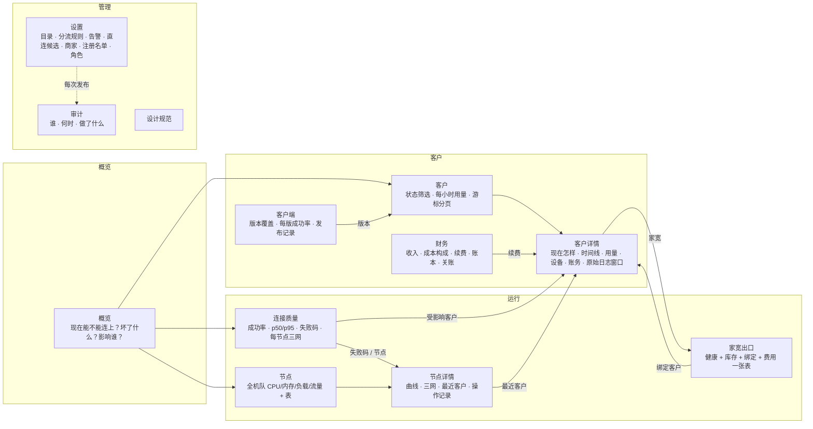

# 运维后台重做：信息架构、设计规范与分期计划

归属：[运维计划](plan-2026-09-11.md)（不是 ship gate）。状态：第二阶段设计稿，等所有者评审后再动 `src/`。
原型：`services/ops-console/prototype/`（独立 Vite 入口，mock 数据，不碰生产控制台代码）。

```sh
cd services/ops-console
npm run proto      # http://localhost:5175/ops/ ；npm run proto:build 出 dist/prototype
# 地址参数：?range=1h|24h|7d|30d  ?data=loading|stale|error  ?telemetry=on（预览 #707 上线后的面板）
```

## 1. 决定

- 只留一个后台：`services/ops-console` 的代码，挂在 `/ops/`；旧 `/ops2/` 与旧 `/ops/` 书签都跳到新地址。
- `services/control-plane/admin`（Ops 1）在功能对齐后下线；在那之前不删目录，因为 Ops 2 还通过
  `@legacy-lib` 引用 `admin/src/lib`。
- 目录与分流规则只有一个写入点（新后台 设置 → 目录 / 分流规则）；Ops 1 的 PUT 已在 [#713](https://github.com/raydocs/tono/pull/713) 拿掉。

## 2. 信息架构

每个一级页面先回答一个问题，再给证据。侧栏四组，最多两级；⌘K 能直接跳到页面、节点和客户。



| 页面 | 首屏回答 | 主要数据源 |
| --- | --- | --- |
| 概览 | 严重故障数、受影响客户数，一句话结论；今天要做的事 | `ops_incidents` `ops_customer_status` `connection_events` `operations_live_snapshot` |
| 连接质量 | 成功率是否达标、慢在哪、为什么失败；SLO 从 设置→账本 挪到这里 | `ops_connection_daily` `connection_events` `ops_daily_slo` |
| 节点 | 哪台坏、哪台忙、哪台不值 | `operations_agent_samples` `operations_live_snapshot` hub 探针 |
| 家宽出口 | 能不能用、给了谁、花多少、何时续费（取代「家宽库存」「家宽资产」两页） | `home_exits` `operations_home_probe_samples` |
| 客户 / 详情 | 谁连不上、谁快到期、这位客户此刻怎样 | `ops_customer_status` `operations_user_usage_hours` `ops_ledger_entries` |
| 客户端 | 新版覆盖了多少、哪一版在出问题 | `client_releases` `ops_device_status` |
| 财务 | 本月收支、毛利、要续费的人 | `ops_ledger_entries` `usage_report_sources` |
| 设置 / 审计 | 线上是什么、谁改的 | `managed_exit_catalog` `managed_traffic_policy` `ops_audit` |

## 3. 必须照着设计的数据事实

- `connection_events.edge_*` 是 用户→Cloudflare 那一段，不是回程线路。页面只按「客户端上报的运营商」分，
  并在图下写明；不画「回程线路」。
- Activity 的字节数从来没写入（#403）：用量一律来自 `operations_user_usage_hours` / `usage_report_sources`，
  计费以 `usage_report_sources` 为准，页面写出这一句。
- #707（迁移 0093：`failure_clusters` `client_sessions` `chain_hops` `dns_checks` `ai_service_routes`
  `session_exit_observations`）没上线前，连接质量页底部只放一行一行的「未接入」说明，不画空图；
  `?telemetry=on` 展示上线后的面板（每跳握手、DNS 漂移、AI 服务出口、失败聚类）。
- 「今天要做」用 Worker 的阈值（用量 ≥ 80%、7 天内到期）。正式版由 Worker 返回阈值，客户端不再各算一份。
- 列表不设 2000 上限：服务端游标分页，页脚写「服务端游标分页，不设上限」。
- 「标记直连」目前后端没接：正式版要么接上 `direct-candidates/{etld1}/accept`，要么不显示按钮；不再出现「接口未接入」。

## 4. 设计规范（原型 `/design` 页可交互查看）

- **字体**：Geist / Geist Mono + 系统中文字体；数字一律等宽数字（`.num`）。字号 11 / 12 / 14 / 20 / 24 / 32，
  分别用于坐标轴、表格、正文、页面标题、统计数字、首页结论。
- **间距**：4 的倍数；面板内边距 16，面板间距 16；表头 32、行高 40。圆角 4 / 6 / 8 / 12。
- **颜色**：浅色与深色两套 CSS 变量（`bg panel panel-2 hover line line-strong fg muted faint accent`），组件只引用变量。
  状态色五种且只表达状态：正常（绿）、注意（橙）、故障（红）、信息（蓝）、闲置（灰），每种带一个浅底色。
  序列色 c1–c6 只用来区分线条，不表达好坏。
- **面板**：每块数据都是一个 Panel，标题栏右侧写数据源和新鲜度。加载、出错、陈旧由面板自己处理：
  一个接口慢或挂，只影响那一块；出错时不显示旧数字；陈旧超过阈值变橙并写「已陈旧」。
  首页结论在读不到 `connection_events` 时显示「现在判断不了」，永远不在没数据时说「一切正常」。
- **空与未接入**：空列表给一句原因；没数据源的指标用「未接入」一行说明，不画空图。
- **图表**：自绘 SVG，一套组件：`LineChart`（多序列、面积/虚线、目标线、事故阴影、十字准星悬停读数、空值断线）、
  `Bars`（堆叠、悬停读数）、`Spark`、`ProbeStrip`（缺测画斜线，不当成失败）、`Heatmap`、`Meter`。
  不引图表库的理由：现有控制台已经自绘；这些组件合计不到 400 行，零依赖；
  原型构建首屏 JS gzip 141.9 KB、全部 JS 172.0 KB（含 mock 数据），离 400 / 600 KB 预算很远。

## 5. 截图

- 改前：`/opt/cursor/artifacts/screenshots/before-ops1/`（Ops 1）、`before-ops2/`（Ops 2，含深色）。
- 改后：`/opt/cursor/artifacts/screenshots/after/`：12 个页面各一张浅色、一张深色；
  `13-observe-707-on`、`14-home-loading`、`15-home-stale`、`16-nodes-error`、`16b-home-error`、`17`–`22` 设置各分区。

## 6. 自评（原型，mock 数据，1440 宽）

| 页面 | 分 | 还差什么 |
| --- | --- | --- |
| 概览 | 8.5 | 真实数据下的结论句模板；事故认领后的状态流转 |
| 连接质量 | 8.5 | 失败码行点开的样本抽屉；#707 面板要用真数据校准 |
| 节点 | 8 | 表格列多，窄屏要收列；批量操作 |
| 节点详情 | 7.5 | 操作（重启、下架）的确认与进度；接收记录 |
| 家宽出口 | 8 | 换绑流程；批量导入的校验页 |
| 客户 | 8 | 保存筛选；CSV 导出的字段说明 |
| 客户详情 | 8.5 | 时间线事件点开看原文；跟进记录 |
| 客户端 | 7.5 | 发布前校验的逐步进度；按平台拆开的回滚入口 |
| 财务 | 7.5 | 柱图缺纵轴刻度；关账流程只有入口 |
| 设置 | 7 | 直连候选 / 商家 / 注册名单只画了表，编辑流程没做 |
| 审计 | 7.5 | 行点开看请求详情与前后差异 |
| 设计规范 | 8 | 缺表单控件与抽屉的规范 |

整体约 8 分。到 9 分还需要：接真数据后按真实分布调阈值与文案、抽屉式详情（失败样本、审计差异）、
键盘导航（j/k 行移动）、1280 以下的布局、表单与抽屉规范、无障碍检查（对比度、焦点顺序）。

## 7. 分期重做计划（G4 冻结解除后，每期一个 PR）

每期都在 `src/` 里做，遵守现有规则：中文文案只进 `src/copy`，数字只在 `components/ops` 与 `lib/display` 格式化，
文件 ≤ 400 行，首屏 ≤ 400 KB gzip；不新增 Playwright 或 UI 单测，只更新受影响页面的现有截图基线。

1. **地基**：把 tokens、Panel/状态组件、图表组件搬进 `src/components/ops`；深色模式。页面不变。
2. **挂到 `/ops/`**：Worker 静态路径改为 `/ops/`，`/ops2/*` 与旧 `/ops/#/…` 路由 301 到新地址；Ops 1 入口先保留在 `/ops/legacy/`。
3. **概览 + 连接质量**：结论卡、今天要做（阈值改由 Worker 返回）、SLO 从 设置→账本 移到连接质量。
4. **节点 + 节点详情**：补齐 Ops 1 的全机队 24 小时曲线。
5. **客户 + 客户详情**：服务端游标分页取代 2000 上限；每小时用量；原始日志窗口（`customers.raw-logs`，依赖 [#716](https://github.com/raydocs/tono/pull/716)）。
6. **家宽出口**：合并「家宽库存」「家宽资产」；闲置家宽与 Claude 账号计数；接上或去掉「标记直连」。
7. **客户端 / 财务 / 设置 / 审计**：按原型重排；Ops 1 独有的完整诊断 JSON 放进客户详情的折叠区。
8. **#707 面板**：迁移 0093 部署后打开连接质量页的诊断区。
9. **下线 Ops 1**：把 `@legacy-lib` 用到的代码搬进 ops-console，删 `services/control-plane/admin`，删 `/ops/legacy/`，更新 `parity-audit.md`。
