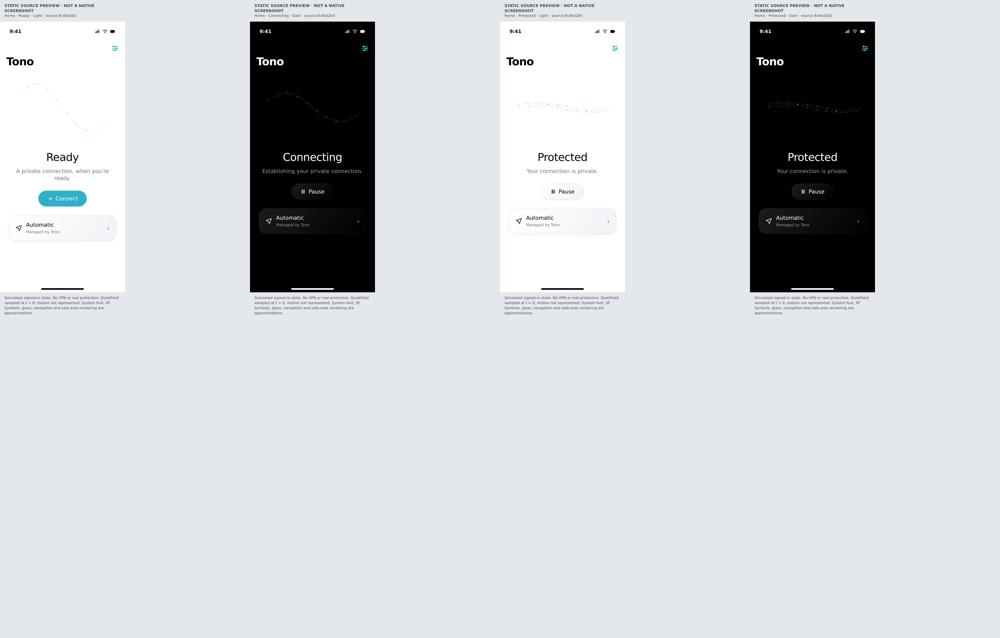
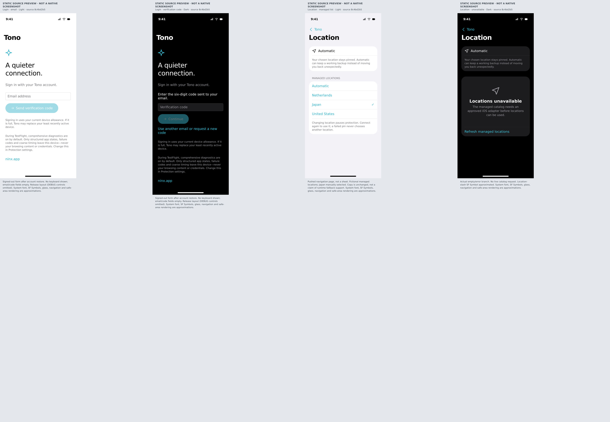
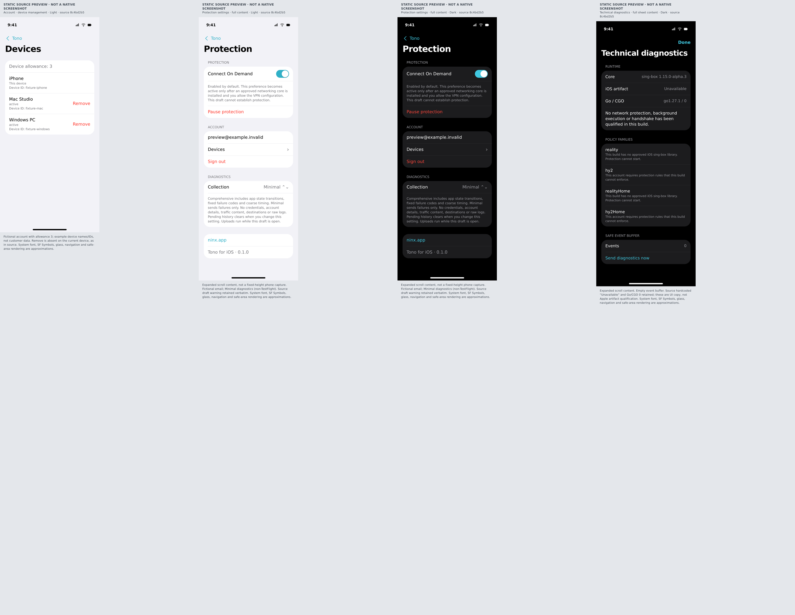

# Source-derived static iOS previews — not native screenshots

Frozen source:
[8c4bd2b50cd4eb75a73b2a6fd902e60a6ea32051](https://github.com/raydocs/tono/commit/8c4bd2b50cd4eb75a73b2a6fd902e60a6ea32051)
on `feat/ios-native-companion`. Local and remote heads matched before capture.
No exact-head native captures were found locally or in the checked GitHub Actions
artifact listing. No product behavior was changed to produce these images.

## Home: Ready, Connecting, Protected light and dark

## Login and Location: email/code, managed list and unavailable

## Devices, Protection settings and technical diagnostics

## Method and limits

[source-preview.html](source-preview.html) manually transcribes the current
SwiftUI hierarchy/content from `App/Views.swift`, `QuietField.swift`, `TonoApp.swift`
and associated `AppModel`/shared models. All source paths are under `apps/ios/`.
Explicit spacing (28/12/20), 220-point field height, 24-point location surface,
teal tint, state/action copy and the 96-particle formula at t=0 are preserved.

Rendered in Chromium with agent-browser at 393 CSS px, DPR 2; the browser's
1572px-wide output was normalized to 786px-wide review PNGs. Each capture passed
ready/DPR/no-horizontal-overflow checks. All twelve were visually inspected in
the overview boards, plus the initial Ready capture individually. No clipping
or overlap was observed. This does not execute or verify SwiftUI.

- Arial/SVG/CSS approximate San Francisco, SF Symbols, Liquid Glass, native
  Form/List, switches, safe areas and navigation. Not pixel-equivalent iOS output.
- No keyboard, motion, touch, Dynamic Type, VoiceOver, VPN or Apple SDK execution.
  Protected is a simulated state; account/device/location data are fictional.
- Release-style layout omits DEBUG preview/development controls. Collection is
  Minimal (non-TestFlight). Code entry omits the automatically focused keyboard.
- Location is a pushed page, not a sheet. Diagnostics is a sheet shown standalone.
  Long code-entry/settings/diagnostics captures expand scroll content for review.
- Source draft warnings and hardcoded `Unavailable` / `go1.27.1 / 0` are unchanged;
  they are UI text, not evidence of patched-runtime capabilities or qualification.

## Individual PNGs and reproduction

Open `source-preview.html` with the query below; set viewport 393x1000 at DPR 2,
wait for `document.documentElement.dataset.ready`, then capture the full page.
Normalize to 786px width if capture applies an additional scale factor. No network
or external assets are required. The overview order is 01–04, 05–08, then 09/12/10/11.

| Image | Query |
|---|---|
| [01 Ready light](01-home-ready-light.png) | `?page=ready&theme=light` |
| [02 Connecting dark](02-home-connecting-dark.png) | `?page=connecting&theme=dark` |
| [03 Protected light](03-home-protected-light.png) | `?page=protected&theme=light` |
| [04 Protected dark](04-home-protected-dark.png) | `?page=protected&theme=dark` |
| [05 Email login light](05-login-light.png) | `?page=login&theme=light` |
| [06 Verification code dark](06-login-code-dark.png) | `?page=code&theme=dark` |
| [07 Managed Location light](07-location-light.png) | `?page=locations&theme=light` |
| [08 Location unavailable dark](08-location-unavailable-dark.png) | `?page=locations-empty&theme=dark` |
| [09 Device management light](09-devices-light.png) | `?page=devices&theme=light` |
| [10 Settings dark](10-settings-dark.png) | `?page=settings&theme=dark` |
| [11 Technical diagnostics dark](11-diagnostics-dark.png) | `?page=diagnostics&theme=dark` |
| [12 Settings light](12-settings-light.png) | `?page=settings&theme=light` |

Verify `SHA256SUMS.txt` from this directory. Verify `source-files.sha256` from the
repository root. Source checksums bind the reconstruction to its owning Swift
files, but do not establish pixel fidelity. See the [review handoff](../../README.md)
for implementation, portable evidence and the workflow-permission blocker.
