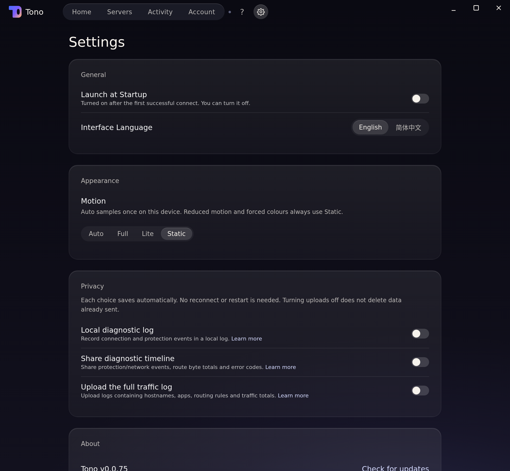
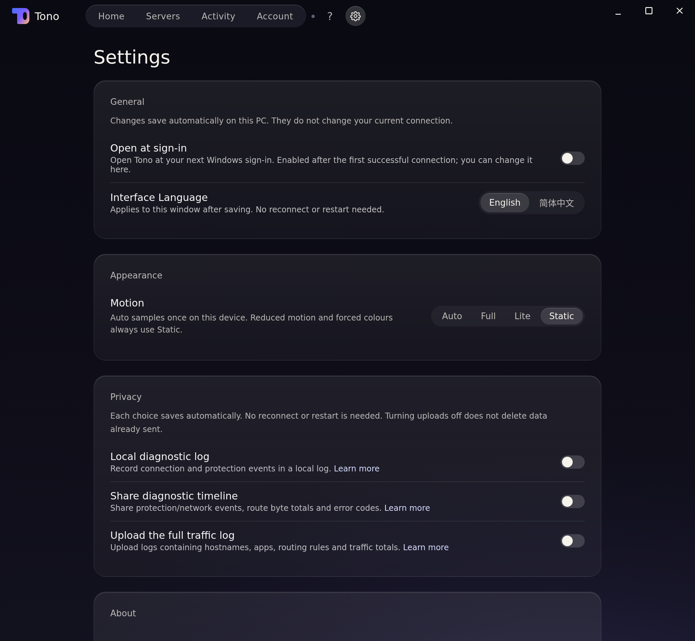
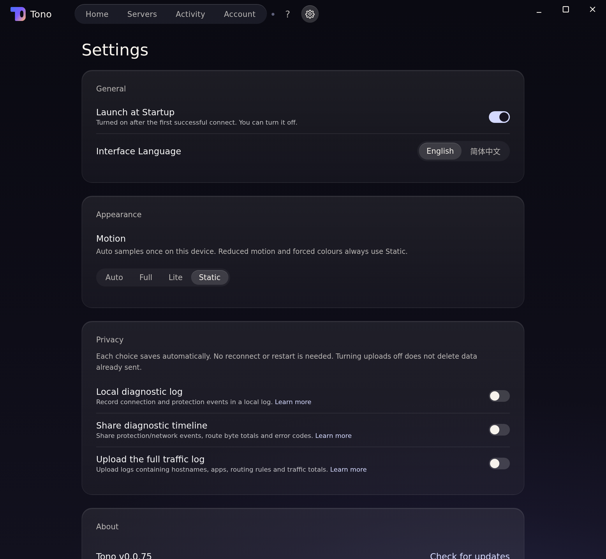
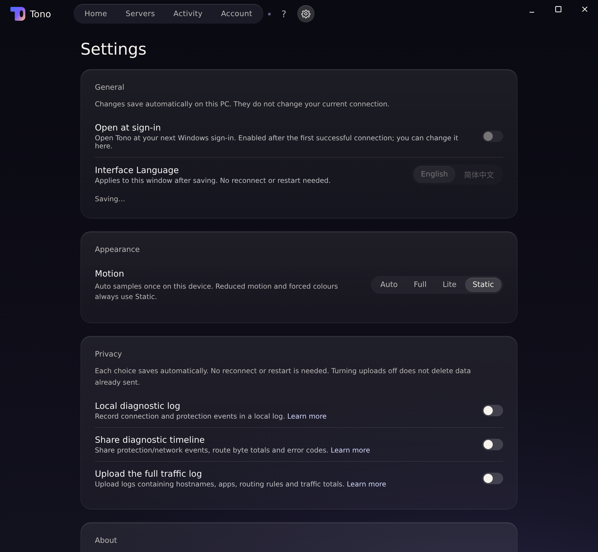
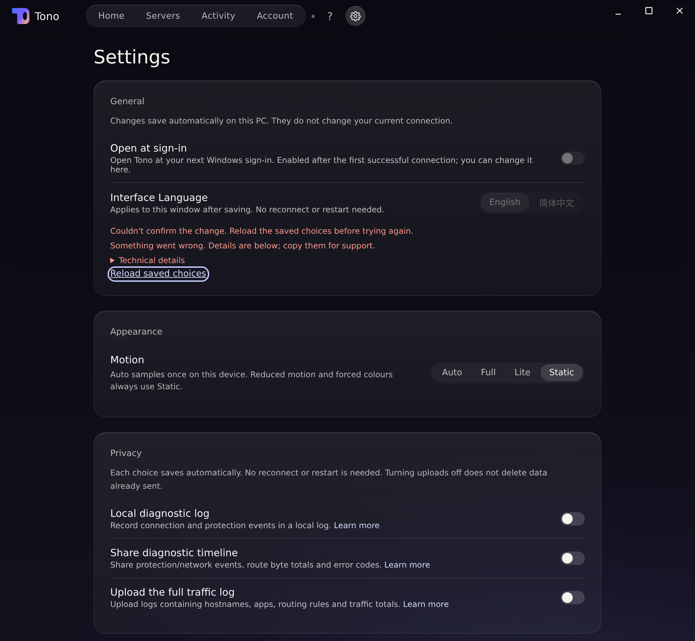
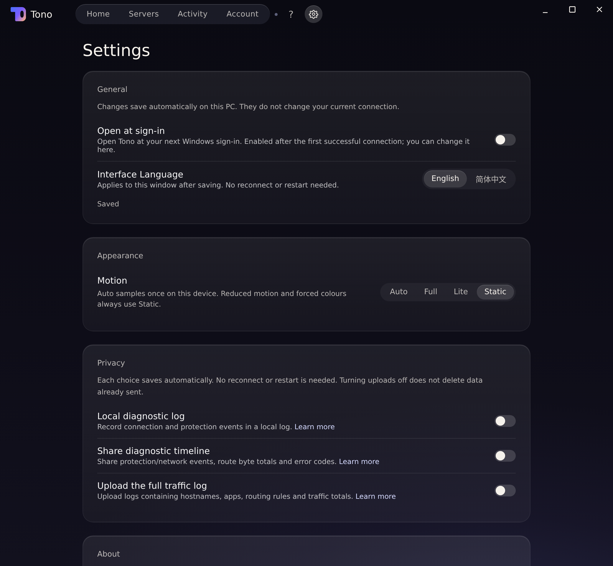
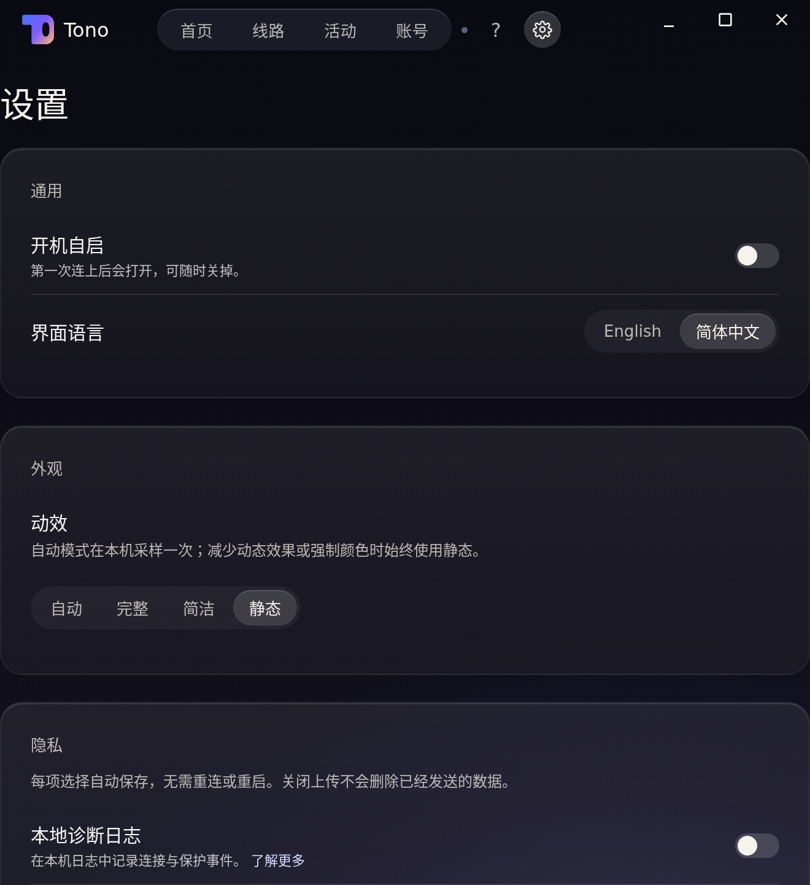
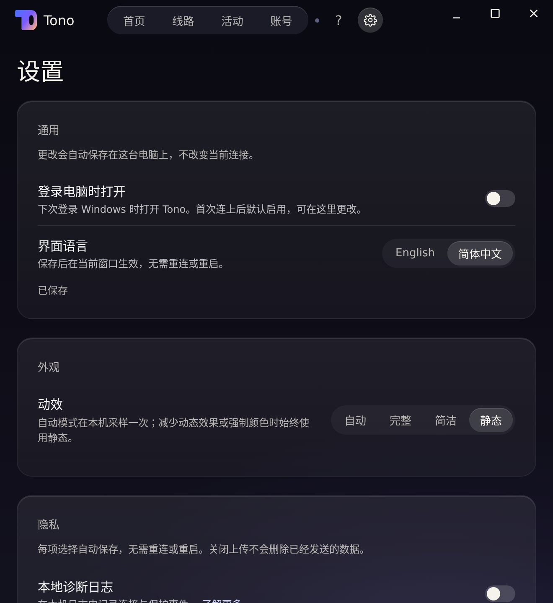
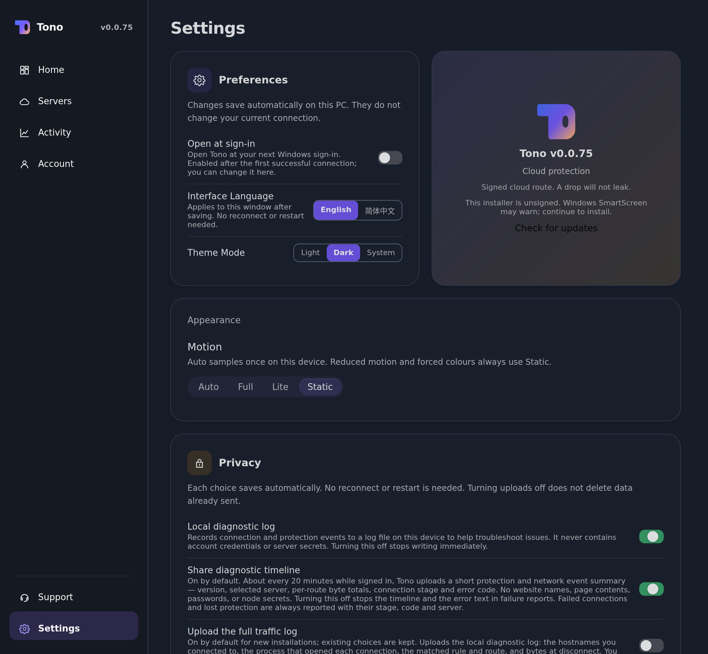

# Windows 通用设置：保存反馈与窄窗

## 来源与方法

- Before：生产 UI/hook [b9922d78217e7032bd15b7e2c26e176b1f756ad6](https://github.com/raydocs/tono/commit/b9922d78217e7032bd15b7e2c26e176b1f756ad6)。
- After：所有 after PNG 的生产 UI/hook [e2e75c5462e7c871e0f4a7a0c8e44d47b371fbfc](https://github.com/raydocs/tono/commit/e2e75c5462e7c871e0f4a7a0c8e44d47b371fbfc)。后续归档 commit 只改本目录与记录，不改应用。
- Linux orb、Chromium 155、DPR **2**；正常 1040×960 CSS px，窄窗 660×720。不是 Windows 原生 WebView2/Segoe UI，也不是 macOS 截图、已安装候选包或真机验收。
- 使用 `vite.shell-preview.config.mts` 的生产设置组件、偏好 hook、i18n、共享 query cache 和生产 `swrConfig`；只有原生 IO、设备状态和路由入口使用合成 fixture。海景使用现有 Static 模式，无图片后期修饰。
- Before 在独立 b9922d78 worktree 加入同一合成读写/延迟/丢失回执入口和 SWR 配置；仍调用该 SHA 的生产偏好 hook，不加入新的操作状态导出。**这是带共用测试入口的基线，不冒称完全未改树渲染。** 两边原生合成值均先写入、再延迟回执，故失败可以留下已变更的值。
- 路由 `?route=/settings&lang=en`；`generalReadDelay` / `generalSaveDelay` 为毫秒，`generalReadError` 为首次读取失败，`generalSaveError` 为首次保存后丢回执；`appearance=old` 检查旧外观。没有用户账号、真实节点、个人日志、权限安装或远端上传。

## 执行的行为对照（截图本身不证明时序）

| 场景 | 执行结果 |
|---|---|
| 旧版延迟保存 | DOM `checked=true, disabled=false, status=null`；丢回执后独立合成 getter `actual=true, displayed=false, disabled=false`，旧界面猜测了回滚 |
| 新版读取/保存 | General 控件禁用，显示 Reading / Saving；不影响独立的外观、隐私操作 |
| 保存后丢回执、离开设置再返回 | 仍显示“无法确认”，禁用 General，不显示 Saved；从 Servers 返回用 Settings 链接的键盘 Enter |
| 键盘恢复 | 聚焦 Reload saved choices，Enter → 实际读到 ON 后解锁，再保存 OFF 成功后才显示 Saved |
| 后台读到已写入的语言、setter 回执仍待到达 | 通过公开 `revalidateQuery(['getTonoPreferences'])` 读回：`storedLanguage=zh, windowTitle=Settings, phase=Saving…, disabled=true`；成功回执后窗口才变中文 |
| 窄窗 | DOM `width=660, dpr=2, titleX=20, overflow=false`；选项完整，说明可换行；旧版标题 x=0 |
| 写入成功但读回失败 | 保留的公开 GeneralCard 回归断言不确认 Saved、不切换语言；成功重新读取后才能继续 |

`vitest run src/pages/settings.test.tsx src/tono-ui/SeaControls.test.tsx src/tono-ui/AppearanceCard.test.tsx src/tono-ui/tono-layout.test.tsx --maxWorkers=1`：4 files / 11 tests passed；`tsc --noEmit` 通过。旧版回归先失败：读取中的开关 `expected false to be true`。最终 PR CI 以 PR 当前 head 为准，不用截图代替 CI。

## 截图（3 before + 9 after）

正常态前后：

旧版提前确认 / 新版待确认：

窄窗前后和旧外观：

## 留给最终完整包/设备验收

Windows 11 原生 WebView2/Segoe UI、DPI 与窗口最小尺寸、原生键盘/鼠标及标题栏拖动、实际登录项注册与系统策略、真实 IPC/磁盘失败和网络恢复，均未通过这些模拟图验证。浏览器自动点击 SVG 设置图标曾未导航，而同链接键盘 Enter 可用；未把该工具表现推断成原生故障或声称原生鼠标通过。

Mac 语言重开/保护代价和 Login Items 属另一个独立交付。现有首页/连接、保护状态映射、PF/WFP/helper、原生 preferences setter/默认值不在本 PR 的修改范围；不自评体验分数，不批准发布。
